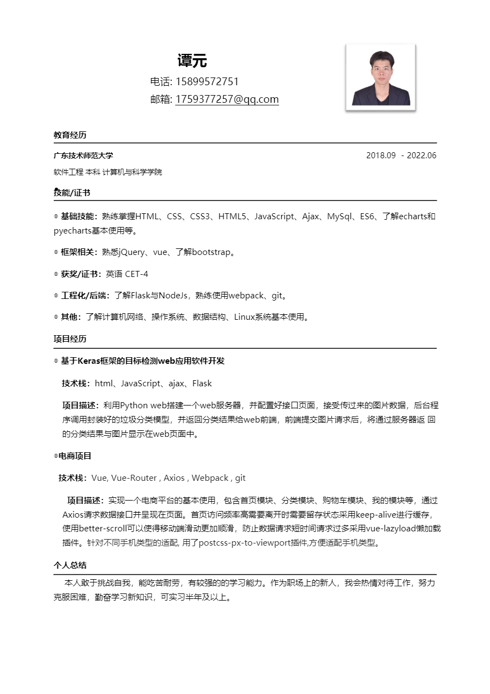

## 关于我

## 谭元
电话: 15899572751 
邮箱: 1759377257@qq.com
 

## 教育经历

广东技术师范大学
软件工程 本科 计算机与科学学院 2018.09  - 2022.06

 
## 技能/证书
 
◎ **基础技能**：熟练掌握HTML、CSS、CSS3、HTML5、JavaScript、Ajax、MySql、ES6、了解echarts和pyecharts基本使用等。

◎ **框架相关**：熟悉jQuery、vue、了解bootstrap。

◎ **获奖/证书**：英语 CET-4

◎ **工程化/后端**：了解Flask与NodeJs，熟练使用webpack、git。

◎ **其他**：了解计算机网络、操作系统、数据结构、Linux系统基本使用。

## 项目经历

◎ **基于Keras框架的目标检测web应用软件开发**
  
  **技术栈**：html、JavaScript、ajax、Flask

  **项目描述**：利用Python web搭建一个web服务器，并配置好接口页面，接受传过来的图片数据，后台程序调用封装好的垃圾分类模型，并返回分类结果给web前端，前端提交图片请求后，将通过服务器返回的分类结果与图片显示在web页面中。

◎ **电商项目**
  
  **技术栈**：Vue, Vue-Router , Axios , Webpack , git
  
  **项目描述**：实现一个电商平台的基本使用，包含首页模块、分类模块、购物车模块、我的模块等，通过Axios请求数据接口并呈现在页面。首页访问频率高需要离开时需要留存状态采用keep-alive进行缓存，使用better-scroll使得移动端滑动更加顺滑，防止数据请求短时间请求过多采用vue-lazyload懒加载插件。针对不同手机类型的适配, 用了postcss-px-to-viewport插件,方便适配手机类型。
## 个人总结
  本人敢于挑战自我，能吃苦耐劳，有较强的的学习能力。作为职的新人，我会热情对待工作，努力克服困难，勤奋学习新知识，可以实习半年及以上。

## 简历

